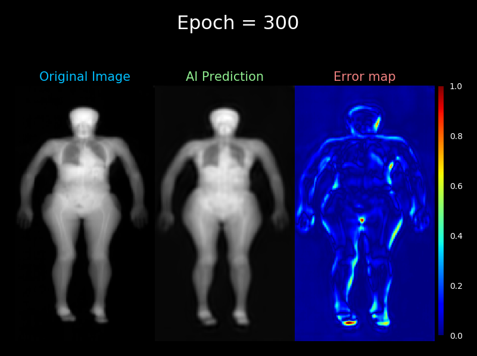

# DXA-VAE

This repo houses code used for NeurIPS 2022 submission entitled "Quantitative Imaging Principles Improves Medical Image Learning"

- DXA = Dual Energy X-ray Absorptiometry
- VAE = Variational AutoEncoder

---
[](https://youtu.be/hXSL7NVCeAY)

---
## Prerequisites

- Linux Kernel: 4.4+
- CUDA Version: 10.1
- Python 3.6+ and the following modules:
  - Keras_Preprocessing==1.1.2
  -  matplotlib==3.3.4
  -  numpy==1.19.2
  -  pandas==1.2.3
  -  tensorflow==1.13.1

## Usage

- In train.config file:
  - [define path to directory containing data split csv files](https://github.com/LambertLeong/DXA-VAE/blob/9b898fc9866704727b34771c368c8f9cc44771d0/train.config#L33)  
    - directory should contain a files labeled "train.csv", "val.csv", and "test.csv"
      - csv files should contain one column and each row contains a path to DXA npy files
      ```sh
      paths
      path_to_image1
      path_to_image2
      ...
      ```
  - [define model parameter](https://github.com/LambertLeong/DXA-VAE/blob/9b898fc9866704727b34771c368c8f9cc44771d0/train.config#L1-L30)
  - [specify path for saved model](https://github.com/LambertLeong/DXA-VAE/blob/9b898fc9866704727b34771c368c8f9cc44771d0/train.config#L8)
- run train.py

### Example
```sh
python train.py -c train.config
```
---
## Datasets

Data used for training and experiments are available upon request. Inquire at
[https://shepherdresearchlab.org/services/](https://shepherdresearchlab.org/services/)

---
## Models and Weights

Trained VAE, encoder, and Pseudo-DXA models are available upon request. Inquire at
[https://shepherdresearchlab.org/services/](https://shepherdresearchlab.org/services/)

# Citation
```sh
@article{leong2022quantitative,
  title={Quantitative Imaging Principles Improves Medical Image Learning},
  author={Leong, Lambert T and Wong, Michael C and Glaser, Yannik and Wolfgruber, Thomas and Heymsfield, Steven B and Sadowski, Peter and Shepherd, John A},
  journal={arXiv preprint arXiv:2206.06663},
  year={2022}
}
```
